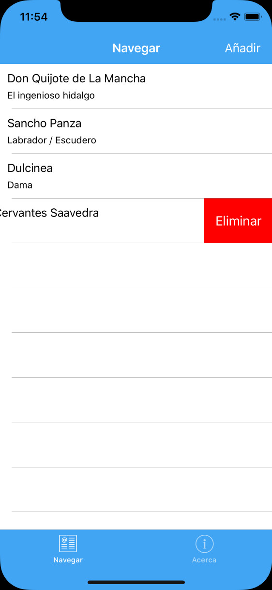

# Xamarin.Forms sample app

A Xamarin.Forms sample app that contains the most of what you need when developing a mobile app from scratch, including a backend project.

## Objectives
* Include everything that is needed for a production-grade mobile app.
* Make it to add or change functionality.
* Stay as true as possible to the original Xamarin.Forms template.

## Features
* Dark Mode theme
* Localization
* ASP.NET Core 3.1 backend with Open API

## Screenshot

## Technology

* Web backend in ASP.NET Core 3.1
* Data Store in Entity Framework Core 3.1
* Inversion of Control (IoC) and Dependency Injection
* CollectionView instead of ListView.

## Futures
* UITests
* IntegrationTests